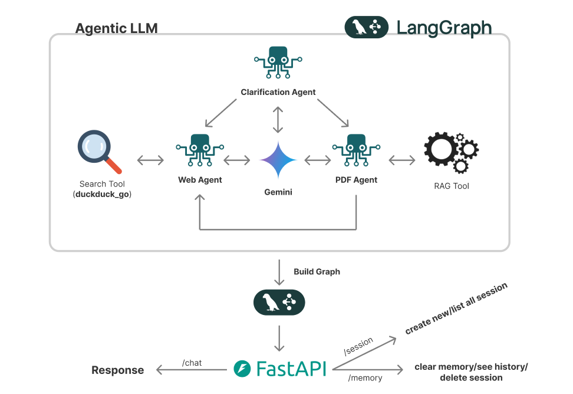
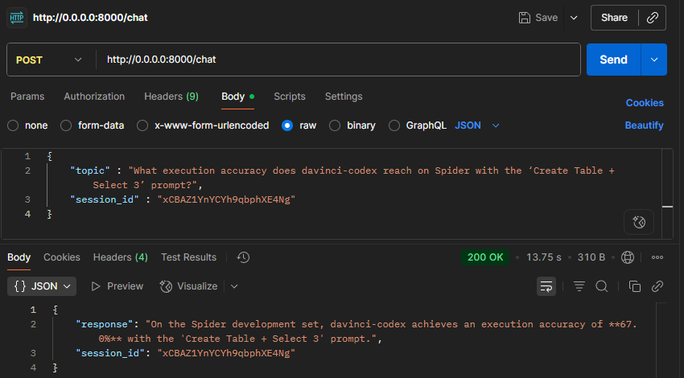

<div id="top">

<!-- HEADER STYLE: CLASSIC -->
<div align="center">


# <code>Arcfusion Assignment: Chat with PDFs</code>

<em></em>

<!-- BADGES -->
<!-- local repository, no metadata badges. -->

<em>Built with the tools and technologies:</em>


</div>
<br>

---

## Table of Contents

- [Table of Contents](#table-of-contents)
- [Overview](#overview)
- [Features](#features)
- [Project Structure](#project-structure)
- [Getting Started](#getting-started)
    - [Prerequisites](#prerequisites)
    - [Installation](#installation)
    - [Usage](#usage)
- [Roadmap](#roadmap)
- [Tradeoffs & Next Steps](#tradeoffs-and-next-steps)
- [Acknowledgments](#acknowledgments)

---

## Overview

**Background**
We are exploring the capabilities of modern LLM architectures to accelerate research workflows. 
We’ve collected a set of academic papers (PDFs) on generative AI, and we need your help to 
build a backend system that enables intelligent question-answering over this corpus. 

This system should behave like a “Chat With PDF” assistant — capable of handling ambiguous 
queries, answering questions based on the documents, and performing a web search 
either when explicitly requested by the user (e.g., “Search online for...”) or when the answer 
cannot be found in the provided PDFs.

<h5> From the information given, the assignment given was to: </h5>

- Create a assistant Chatbot that answer question based on context
- The relevant context can be found inside the given PDFs (research papers)
- If the question is out-of-scope the Chatbot will extract and retrieve information from the website
- The user can also make the intent to search themselves
- The Chatbot can handle ambiguous or vague questions

<h4> Architecture (Brief) </h5>




---

## Features

<h5> ❯ Multiagent + Tools - Search for information inside PDF(s) and on Website(s)</h5>

``` Found in (./app/agents/tools.py) ``` 

``` 
# create pdf search tool
@tool("search_vectorDB")
def search_vectorDB(query: str) -> str:
    """
    Search the LanceDB 'docling' table for relevant context.

    IMPORTANT:
    Always pass the user's query EXACTLY as they wrote it.
    Do not paraphrase, summarize, or remove words.
    Do not change the num_results.
    Args:
        query: The search query text.
        num_results: The number of top results to return.
    Returns:
        A string containing the top matching chunks.
    """
    results_df = ( table.search(query, query_type="hybrid")
        .rerank(reranker=reranker)
        .limit(10)
        .to_pandas()
    )

    contexts=[]
    # get and store metadata
    for _, row in results_df.iterrows():
        filename = row["metadata"]["filename"]
        page_numbers = row["metadata"]["page_numbers"]
        title = row["metadata"]["title"]

        source_parts = []
        if filename:
            source_parts.append(filename)
            
        if page_numbers is not None and len(page_numbers) > 0:
            source_parts.append(f"p. {', '.join(str(p) for p in page_numbers)}")
        source = f"\nSource: {' - '.join(source_parts)}"

        if title:
            source += f"\nTitle: {title}"

        contexts.append(f"{row['text']}{source}")
    
    return "\n\n".join(contexts)
``` 

<h5> ❯ Web Search Tool </h5>

``` Found in (./app/agents/tools.py) ``` 

```search_tool = DuckDuckGoSearchRun()``` 

<h5> ❯ Clarification Node - Clarify ambiguous questions </h5>

``` Found in (./app/agents/workflow.py) ``` 

```
# node containing clarification_agent
async def clarification_node(
    state: MessagesState,
) -> Command[Literal[END]]:
    message = state["messages"][-1].content

    prompt = f"""
            You are an assistant whose job is to check if a user question is ambiguous.
            If it is ambiguous, rewrite it as a clarification question.
            If it is clear, reply only with 'CLEAR'.

            For example, 'How many examples are enough for good accuracy?' → 
            Depends on dataset complexity and target accuracy.
            Please clarify the dataset size, type, and your accuracy goal.

            User question: "{message}"
            """
    llm_response = await llm.apredict(prompt)

    if llm_response.strip().upper() != "CLEAR":
        clarification_msg = HumanMessage(content=llm_response.strip(), name="clarification")
        return Command(
            update={"messages": state["messages"] + [clarification_msg]},
            goto=END
        )

    # Query is clear → pass messages to next node
    return Command(update={"messages": state["messages"]}, goto="multiagent")
```

<h5> ❯ Lang Graph implementation </h5>


**Description:**
This graph is created based on the efficiency and use case based on goals listed by the assignments.
The flow started by going through **clarify** node which contain an inner llm for deciding whether to continue to the next node
(multiagent_node for tool selection)based on the clarity of the question.

**multiagent** node contain **multiagent** (for PDF and Web Search) which leverage the use of RAG tool to find relevant context from PDFs and uses duckduckgo_search as a search tool for searching information relevant to the query on websites.

<h5> ❯ RAG Pipeline </h5>

All of these snippets can be found in ```./app/services```

**Load PDFs**
The snippets of a function below load and convert documents into text along with its metadata:
```documents``` append all the textual data found from each PDF document.
```
from docling.document_converter import DocumentConverter

try:
    converter = DocumentConverter()
    document = converter.convert(source=file_path)
    documents.append(document.document)
    logging.info(f"{pdf_file} successfully loaded and extended.")

except Exception as e:
    logging.error(f"Failed to load {pdf_file}: {str(e)}")
```

**Text Processing**
The snippets of a function below process text from document using HybridChunker 
into chunks along with its metadata:
```
chunker = HybridChunker(
        tokenizer=tokenizer,
        merge_peers=True
    )

    for document in documents:
        document_fname = document.origin.filename
        logging.info(f"Separating {document_fname} into chunks")
        try:
            chunk_iter = chunker.chunk(dl_doc=document)
            chunks.extend(list(chunk_iter))
        except Exception as e:
            logging.error(f"Cannot separate {document_fname} into chunks: {str(e)}")

        logging.info(f"Separated {document_fname} into {int(len(list(chunk_iter)))} chunks")

    logging.info(f"Total number of chunks: {int(len(chunks))}")
```

**Store Memory as VectorDB**
The snippets of a function below connect to db and create function for using hf embedding model:
```
db = lancedb.connect("data/lancedb")
func = get_registry().get("huggingface").create(name="intfloat/multilingual-e5-large-instruct") #hf model
```

The snippets of a function below create class for storing text, vector and metadata into table:
```
class Chunks(LanceModel):
    text: str = func.SourceField()
    vector: Vector(func.ndims()) = func.VectorField()
    metadata: ChunkMetadata

table = db.create_table("docling", schema=Chunks, mode="overwrite")
table.add(processed_chunks)
```
All the functions are then called to create the complete pipeline:
```
pdf_directory = "./data/papers" # directory of papers
documents = load_pdf(directory=pdf_directory) # load data from PDFs
chunks = text_processing(documents=documents) # process text
print(embeddings_to_vectordb(chunks=chunks).to_pandas()) # embed text into vector database
```

---

## Project Structure

```sh
└── /
    ├── app
    │   ├── __init__.py
    │   ├── __pycache__
    │   ├── agents
    │   │   │── multiagent.py
    │   │   │── system_prompt.py
    │   │   │── tools.py
    │   │   │── workflow.py
    │   │   │── __init__.py
    │   │   └── __pycache__
    │   ├── api
    │   │   │── main.py
    │   │   │── __init__.py
    │   │   └── __pycache__
    │   ├── models
    │   │   │── llm_model.py
    │   │   │── __init__.py
    │   │   └── __pycache__
    │   ├── services
    │   │   │── ingest.py
    │   │   │── pdf_loader.py
    │   │   │── text_processing.py
    │   │   │── __init__.py
    │   │   └── __pycache__
    │   └── test
    │       │── __init__.py
    │       └── __pycache__
    ├── data
    │   ├── lancedb
    │   └── papers
    ├── .env
    ├── docker-compose.yml
    ├── dockerfile
    ├── .dockerignore
    ├── README.md
    ├── .gitignore
    └── requirements.txt
```

---

## Getting Started

### Prerequisites

This project requires the following dependencies:

- **Programming Language:** Python
- **Package Manager:** Pip
- **Container Runtime:** Docker
- **API for LLM:** Google API

### Installation

Build  from the source and install dependencies:

1. **Clone the repository:**

    ```sh
    ❯ git clone https://github.com/skyeded/chat-with-pdf.git
    ```

2. **Navigate to the project directory:**

    ```sh
    ❯ cd ./chat-with-pdf
    ```

3. **Install the dependencies:**


	**Using [pip](https://pypi.org/project/pip/):**

	```sh
	❯ pip install -r requirements.txt
	```

### Usage

Modify your **[.env]()**:

**Rename .env_example to .env and enter the required environmental variables:**

(langsmith is optional)
```sh
GOOGLE_API_KEY=
LANGSMITH_TRACING="true"
LANGSMITH_ENDPOINT="https://api.smith.langchain.com"
LANGSMITH_API_KEY=
LANGSMITH_PROJECT=
```

Run the project with:

**Using [docker](https://www.docker.com/) (build image and run):**
```sh
docker-compose up --build
```

(If already built image)
```sh
docker-compose up
```

**Using [uvicorn](https://pypi.org/project/pip/):**
```sh
uvicorn app.main:app --reload
```

Run the PDFs **ingestion** script by:

1. Input documents into ```./data/papers```
2. run bash ```python -m app.services.ingest --pdf-dir ./data/papers``` 

OR

run bash ```python -m app.services.ingest --pdf-dir <your PDFS dir>``` 

**Command** for API calls:-

**/session**:
-   { "**command**" : "new" } → To create new session (get session id)
-   { "**command**" : "show" } → To list or show all session (and session id)

**/chat**: 
-   { "**topic**" : "When was Microsoft found?",
      "**session_id**" : your_session_id } → To communicate with chatbot

**/memory**: 
-   { "**command**" : "clear",
      "**session_id**" : your_session_id } → To clear memory/message history for specified session
-   { "**command**" : "show",
      "**session_id**" : your_session_id } → To show message history for specified session
-   { "**command**" : "del",
      "**session_id**" : your_session_id } → To delete the specified session

*NOTE:* **To communicate with the chatbot and manipulate the memory you are required to input a session id (get session id by typing "new" command for /session as mentioned above)**

### Testing

**[Postman]():**

**To communicate with the chatbot:**


<p></p>

**To clear memory:**


<p></p>


**To show message history:**


<p></p>

**[cURL]():**

**To communicate with the chatbot:**
``` sh
curl -X 'POST' \
  'http://0.0.0.0:8000/chat' \
  -H 'accept: application/json' \
  -H 'Content-Type: application/json' \
  -d '{
  "topic": "Which prompt template gave the highest zero-shot accuracy on Spider in Zhang et al. (2024)?"
}'
```

**To clear memory:**
``` sh
curl -X 'POST' \
  'http://127.0.0.1:8000/clear_memory' \
  -H 'accept: application/json' \
  -H 'Content-Type: application/json' \
  -d '{
  "clear_memory": "clear"
}'
```

**To show messages history:**
``` sh
curl -X 'POST' \
  'http://127.0.0.1:8000/clear_memory' \
  -H 'accept: application/json' \
  -H 'Content-Type: application/json' \
  -d '{
  "clear_memory": "show"
}'
```

**You can also use the built-in docs for FASTAPI by using this url: ```http://127.0.0.1:8000/docs```**

---

## Roadmap

- [X] **`Task 1`**: <strike>Create a assistant Chatbot that answer question based on context</strike>
- [X] **`Task 2`**: <strike>The relevant context can be found inside the given PDFs (research papers)</strike>
- [X] **`Task 3`**: <strike>If the question is out-of-scope the Chatbot will extract and retrieve information from the website</strike>
- [X] **`Task 4`**: <strike>The user can also make the intent to search themselves</strike>
- [X] **`Task 5`**: <strike>The Chatbot can handle ambiguous or vague questions</strike>

**Bonus Points:**
- [X] **`Task 1`**: <strike>Implement a Clarification Agent to detect vague or underspecified queries. </strike>
- [ ] **`Task 2`**: Add a basic evaluation system (e.g., golden Q&A pairs, confidence scoring).

**Real World Scenario:**
- [X] **`Example 1`**: “How many examples are enough for good accuracy” 
→ **“Enough” is vague—needs the dataset and the accuracy target**
- [X] **`Example 2`**: “Which prompt template gave the highest zero-shot accuracy on Spider in Zhang et al. 
(2024)?” → **Zhang et al. report that SimpleDDL-MD-Chat is the top zero-shot template (65–72 % EX across models)**
- [X] **`Example 3`**: What execution accuracy does davinci-codex reach on Spider with the ‘Create Table + 
Select 3’ prompt? → **Davinci-codex attains 67 % execution accuracy on the Spider dev set with that prompt style**
- [X] **`Example 4`**: “What did OpenAI release this month?” 
→ **The system should recognize this is not covered in the PDFs and search the web.**

**Revision Tasks**
- [X] **`Task 1`**: <strike>Make endpoints asynchronous and use non-blocking LLM calls.</strike>
- [X] **`Task 2`**: <strike>Remove internal state exposure from the "clear memory" endpoint and avoid hard-coded thread_id; accept a session_id. </strike>
- [X] **`Task 3`**: <strike>Replace prompt-string routing with robust tool selection (function-calling) or a classifier that decides PDF vs Web.</strike>
- [X] **`Task 4`**: <strike>Initialize DB connections/indices once at startup; avoid recreating them per request.</strike>
- [X] **`Task 5`**: <strike>Move PDF ingestion to a separate CLI/command (not at import time).</strike>
- [ ] **`Task 6`**: <strike>Tidy project structure (separate api/models/services/agents)</strike> and include full source (no placeholders), plus an updated README.
---

## Tradeoffs and Next Steps

<h4> Tradeoffs </h4>

**LanceDB for vector database:**
Pros:

- Hybrid search built-in (vector + keyword via inverted indexes + reranker), good for “needle-in-a-haystack” PDFs.
- Easy local setup; Arrow/Lance columnar storage keeps things fast on disk.

Cons:

- Not as scalable or in managed clouds as Pinecone, Weaviate, or Vertex Matching Engine; fewer turnkey ops features (autoscaling, replication).
- Less community tooling.

**Gemini-2.5-Flash for LLM:**
Pros:

- Very low latency & cost for high-volume agents.
- Great for fast tools/routing steps.

Cons:

- Other models which are most costly are richer in tools usages and better context model

**Docling for document ingestion:**
Pros:

- AI-assisted PDF/Office parsing with layout.
- Great for messy enterprise PDFs.
- Works better with tables compare to traditional langchains document ingestion tools

Cons:

- More complex than traditional document ingestion tools
- Heavier dependency stack than simple text extractors

**intfloat/multilingual-e5-large-instruct as embedding model:**
Pros:

- Instruction-tuned for query-document asymmetry
- Very strong retrieval

Cons:
- 512-token limit
- Slower than smaller/base models (Heavy, not light-weighted)

**NOTE: The project also uses DuckDuckGo search instead of Tavily because it's more compatible with Gemini LLMs (schema)**

<h4> Next Steps </h4>

- Create suitable UI for easier accesibility.
- Upgrade LLMs to a more costly models for more contextual understanding, better retrieval and refined agentic behaviour (and tool calling).
- Switch to vector database that are cloud-based for scalability.
- Improve chunking (switch to Agentic chunking?)
- Find a more optimal embedding model for this use cases
- Better routing prompts
- Add text or info to which document, document pages, the information is extracted from. (Add proper metadata usage)
- Create evaluation functions

